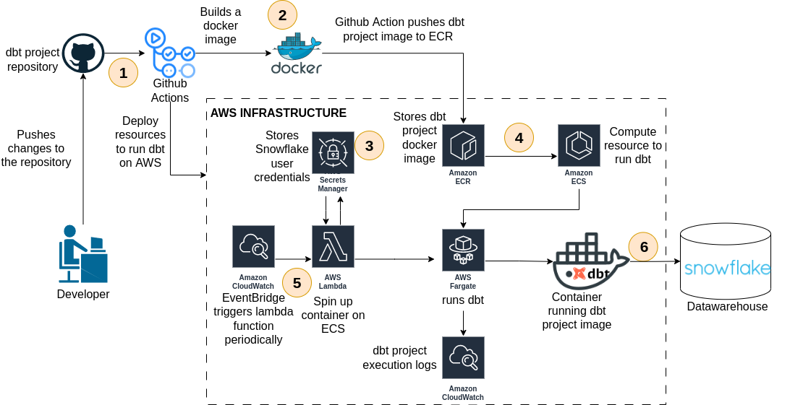

# deploying-dbt-on-ecs-fargate

## Introduction
This repository implements a demo CI/CD pipeline designed to exemplify the 
deployment process of a dbt project on ECS Fargate through GitHub Actions. 
The pipeline is triggered whenever a developer pushes changes to the 
Jaffle Shop dbt project folder. Next, a GitHub Actions job starts by building 
a docker image defined in the dbt.dockerfile located in the 
main directory of this project. This job then pushes the image to an AWS ECR 
repository and deploys an ECS cluster, ECS task definition in Fargate mode, and a 
Lambda function. The Lambda function executes a Python code that retrieves Snowflake 
credentials from AWS Secret Manager and spins up the dbt project container on ECS.

<p align="center">
  
  <br/>
</p>

## Project Tree Directory Structure
```css
.
├── dbt.dockerfile
├── dbt_task_execution_trigger_script.py
├── infra-as-code
│   ├── backend.tf
│   ├── jaffle-shop.vpc.settings.tf
│   ├── main.tf
│   ├── modules
│   │   ├── ecr
│   │   │   ├── main.tf
│   │   │   ├── outputs.tf
│   │   │   └── variables.tf
│   │   ├── ecs-cluster
│   │   │   ├── main.tf
│   │   │   ├── outputs.tf
│   │   │   ├── variables.tf
│   │   │   └── versions.tf
│   │   ├── ecs-task-definition
│   │   │   ├── logging
│   │   │   │   ├── main.tf
│   │   │   │   ├── outputs.tf
│   │   │   │   └── variables.tf
│   │   │   ├── main.tf
│   │   │   ├── outputs.tf
│   │   │   ├── permissions
│   │   │   │   ├── main.tf
│   │   │   │   ├── outputs.tf
│   │   │   │   └── variables.tf
│   │   │   └── variables.tf
│   │   ├── lambda
│   │   │   ├── cloudwatch-trigger
│   │   │   │   ├── main.tf
│   │   │   │   ├── outputs.tf
│   │   │   │   ├── variables.tf
│   │   │   │   └── versions.tf
│   │   │   ├── invoker
│   │   │   │   ├── main.tf
│   │   │   │   ├── variables.tf
│   │   │   │   └── versions.tf
│   │   │   ├── main.tf
│   │   │   ├── observability
│   │   │   │   ├── main.tf
│   │   │   │   ├── variables.tf
│   │   │   │   └── versions.tf
│   │   │   ├── outputs.tf
│   │   │   ├── package
│   │   │   │   ├── main.tf
│   │   │   │   ├── outputs.tf
│   │   │   │   ├── variables.tf
│   │   │   │   └── versions.tf
│   │   │   ├── permissions
│   │   │   │   ├── main.tf
│   │   │   │   ├── outputs.tf
│   │   │   │   ├── variables.tf
│   │   │   │   └── versions.tf
│   │   │   ├── variables.tf
│   │   │   └── versions.tf
│   │   ├── networking
│   │   │   ├── main.tf
│   │   │   ├── outputs.tf
│   │   │   └── variables.tf
│   │   └── vpc-resources
│   │       ├── elastic-ip
│   │       │   ├── main.tf
│   │       │   ├── outputs.tf
│   │       │   └── variables.tf
│   │       ├── internet-gateway
│   │       │   ├── main.tf
│   │       │   ├── outputs.tf
│   │       │   └── variables.tf
│   │       ├── nat-gateway
│   │       │   ├── main.tf
│   │       │   ├── outputs.tf
│   │       │   └── variables.tf
│   │       ├── route-table
│   │       │   ├── main.tf
│   │       │   ├── outputs.tf
│   │       │   └── variables.tf
│   │       ├── security-group
│   │       │   ├── main.tf
│   │       │   ├── outputs.tf
│   │       │   └── variables.tf
│   │       ├── subnet
│   │       │   ├── main.tf
│   │       │   ├── outputs.tf
│   │       │   └── variables.tf
│   │       ├── vpc
│   │       │   ├── main.tf
│   │       │   ├── outputs.tf
│   │       │   └── variables.tf
│   │       ├── vpc-endpoint
│   │       │   ├── main.tf
│   │       │   ├── outputs.tf
│   │       │   └── variables.tf
│   │       └── vpc-peering
│   │           ├── main.tf
│   │           ├── output.tf
│   │           └── variables.tf
│   └── variables.default.tf
├── jaffle_shop
│   ├── analyses
│   ├── dbt_packages
│   ├── dbt_project.yml
│   ├── logs
│   │   └── dbt.log
│   ├── macros
│   ├── models
│   │   ├── customers.sql
│   │   ├── schema.yml
│   │   ├── sources.yml
│   │   ├── stg_customers.sql
│   │   └── stg_orders.sql
│   ├── profiles.yml
│   ├── README.md
│   ├── scripts
│   │   └── dbt_container_init_commands.sh
│   ├── seeds
│   ├── snapshots
│   └── tests
├── Pipfile
├── Pipfile.lock
├── README.md
```
The dbt project resides within the jaffle_shop directory. 
The entire infrastructure of this project is defined through Terraform within 
the "infra-as-code" folder. The Python script that spins up the container on ECS 
is defined in the file "dbt_task_execution_trigger_script.py." 
The Lambda function that runs this Python script can have its execution frequency 
changed in the following block of code presented within the 
"infra-as-code/main.tf" file:
```terraform
LAMBDA_EXECUTION_FREQUENCY = {
    dev = {
      rate  = "5"
      unity = "minutes"
    }
    qa = {
      rate  = "5"
      unity = "minutes"
    }
    stg = {
      rate  = "5"
      unity = "minutes"
    }
    prd = {
      rate  = "5"
      unity = "minutes"
    }
  }
```

## How to Install this Project on Your AWS Account
1. Clone this repository:
```bash
git clone git@github.com:gpass0s/deploying-dbt-on-ecs-fargate.git
```
2. Access the project's "infra-as-code" folder:
```bash
cd streaming-processing-on-aws/infra-as-code
```
3. Access the project's "infra-as-code" folder:
```bash
export AWS_ACCESS_KEY_ID=<your-aws-access-key-id>
export AWS_SECRET_ACCESS_KEY=<your-aws-secret-access-key>
export AWS_DEFAULT_REGION=<your-aws-region>
```
4. Set the Terraform workspace environment:
```bash
terraform workspace select $ENV || terraform workspace new $ENV
```
5. Create a Terraform plan:
```bash
terraform plan
```
6. Apply the terraform project on your own AWS account:
```bash
terraform apply -auto-approve
```

## How to Run the dbt Project Locally:

1. After cloning this project, initiate the virtual environment from the main root folder:
```bash
pipenv install && pipenv shell
```
2. Access the "jaffle-shop" dbt project folder:
```bash
cd jaffle-shop
```
4. Run dbt locally:
```bash
dbt run --profile-dir ~/.dbt/
```